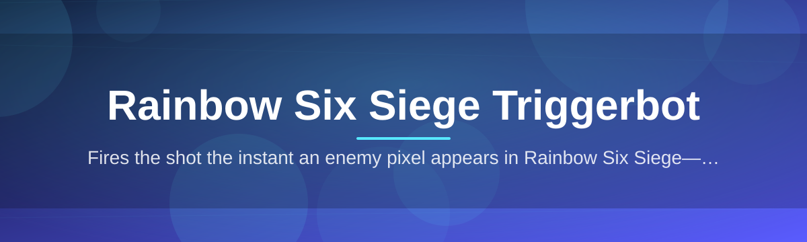

# rainbow-six-siege-trigger-assistant

Fires the shot the instant an enemy pixel appears in Rainbow Six Siege—nothing else.

  

## Overview

Fires the shot the instant an enemy pixel appears in Rainbow Six Siege—nothing else.

## License

[MIT License](LICENSE)
